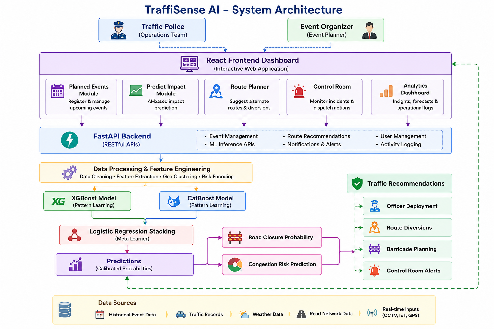

# 🚦 GridLock AI

### Bengaluru Event Intelligence & Predictive Traffic Management Platform

> Transforming Bengaluru's traffic operations from reactive response to proactive intelligence.

---

## 📌 Problem Statement

Bengaluru is one of India's fastest-growing metropolitan cities and faces significant traffic challenges due to large public events, VIP movements, religious gatherings, infrastructure projects, road closures, accidents, and emergencies.

Traditional traffic management systems often respond only after congestion has already occurred, leading to increased travel delays, inefficient resource deployment, operational challenges, and public inconvenience.

There is a growing need for an intelligent system that can predict traffic disruption before it occurs and assist authorities in making proactive operational decisions.

---

## 🌟 Solution Overview

**GridLock AI** is an AI-powered Event Intelligence and Operational Traffic Management Platform designed specifically for Bengaluru Traffic Police and urban traffic authorities.

The platform combines machine learning, predictive analytics, route optimization, operational workflows, and traffic intelligence to proactively manage congestion caused by planned and unplanned events.

By analyzing event characteristics, historical traffic patterns, operational data, geographic factors, and corridor-level risks, GridLock AI predicts congestion severity, road closure probability, and operational requirements before traffic disruption escalates.

---

## 🌆 Bengaluru Traffic Intelligence Platform

GridLock AI is tailored for Bengaluru's complex urban traffic ecosystem.

The platform helps authorities:

* Predict congestion before it occurs
* Assess road closure risks
* Optimize officer deployment
* Recommend alternate routes
* Improve emergency response coordination
* Generate citizen travel advisories
* Support smarter city-wide traffic operations

The solution is designed to support daily traffic operations as well as high-impact events across Bengaluru.

---

## 🚀 Key Features

### 📊 Intelligent Dashboard

A centralized command center providing:

* Active event monitoring
* City-wide traffic overview
* Live event locations
* Hotspot junction identification
* High-priority alerts
* Travel advisories
* Operational KPIs

---

### 📅 Planned Events Management

View and manage:

* Upcoming events
* Affected zones and corridors
* Event priorities
* Expected traffic impact
* Recommended travel windows
* Citizen advisory information

This enables authorities and commuters to prepare before disruption occurs.

---

### 🤖 AI Impact Prediction Engine

The platform's core intelligence module predicts:

* Road Closure Probability
* Traffic Congestion Risk
* Operational Priority Level
* Officer Deployment Requirements
* Barricade Requirements
* Diversion Necessity

Authorities can evaluate risks before congestion escalates.

---

### 🚓 Smart Area Triaging

Automatically identifies:

* Nearest Police Station
* Operational Jurisdiction
* Response Distance
* Recommended Response Time

This significantly improves emergency coordination and resource allocation.

---

### 🎯 Smart Route Recommendation

Based on predicted traffic conditions, the system recommends:

* Alternate Routes
* Diversion Strategies
* Expected Delay Analysis
* Predicted Travel Time
* Affected Corridor Identification
* Citizen Travel Advisories

Helping maintain smoother traffic flow around impacted areas.

---

### 🏢 Control Room Operations

Designed for traffic command centers, enabling:

* Officer Notifications
* Team Dispatch Management
* Incident Resolution Tracking
* QR-Based Event Records
* Activity Logging
* Escalation Management

Ensuring efficient field coordination during high-impact situations.

---

### 📈 Analytics & Forecasting

Generate long-term insights through:

* Traffic Forecasting
* Congestion Trend Analysis
* Hotspot Identification
* Corridor Performance Analysis
* Operational Effectiveness Reports
* Future Event Planning Recommendations

---

## 🧠 Machine Learning Architecture

GridLock AI utilizes a stacked ensemble architecture for accurate risk prediction.

### Base Models

* XGBoost Classifier
* CatBoost Classifier

### Meta Model

* Logistic Regression

### Calibration Layer

* Isotonic Probability Calibration

### Feature Engineering

* Spatial Risk Encoding
* Corridor-Based Features
* Event Severity Features
* Temporal Analysis
* Historical Risk Patterns
* K-Means Geographical Clustering

This architecture generates reliable probability estimates for traffic disruption events and supports downstream operational modules.

---

## 🏗️ System Architecture

  

### Workflow

1. Event Data Input
2. Feature Processing
3. AI Risk Prediction
4. Impact Assessment
5. Route Optimization
6. Operational Recommendations
7. Control Room Execution
8. Analytics & Forecasting

---

## 💻 Technology Stack

### Frontend

* React.js
* JavaScript
* HTML5
* CSS3

### Backend

* FastAPI
* Python

### Machine Learning

* XGBoost
* CatBoost
* Logistic Regression
* Scikit-Learn

### Data Processing

* Pandas
* NumPy
* K-Means Clustering
* Feature Engineering

### Cloud & Deployment

* AWS
* Vercel
* GitHub

---

## 🎯 Impact

GridLock AI enables authorities to:

✅ Predict congestion before it occurs

✅ Reduce traffic disruption during major events

✅ Improve emergency response coordination

✅ Optimize officer and resource deployment

✅ Enhance public safety

✅ Provide better citizen travel guidance

✅ Support data-driven traffic operations

✅ Improve urban mobility planning

---

## 🔮 Future Enhancements

* Real-Time GPS Traffic Integration
* CCTV Video Analytics
* Live Incident Detection
* AI-Based Signal Optimization
* Emergency Vehicle Priority Routing
* A* Route Optimization: Finds alternate routes to avoid congestion and road closures.
* Digital Twin Traffic Simulation
* Smart City Integration APIs

---

## 👨‍💻 Team

Developed as part of Bharat Academix CodeQuest 2026 to demonstrate how Artificial Intelligence can support smarter traffic management, operational efficiency, and urban mobility in Bengaluru.

---

## 📜 License

This project is developed for educational, research, and innovation purposes as part of a hackathon submission.

---

# 🚀 Predict. Plan. Prevent Congestion.

### GridLock AI — Smarter Traffic Starts Before the Jam.
